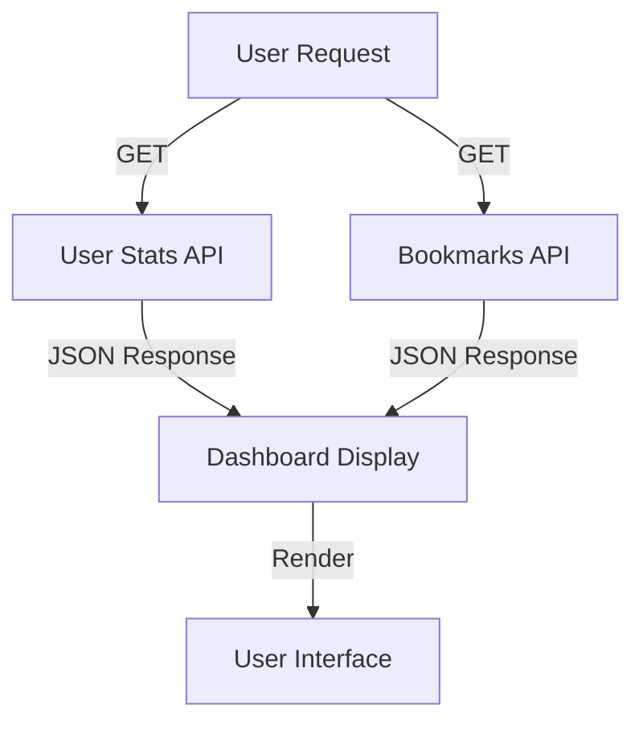
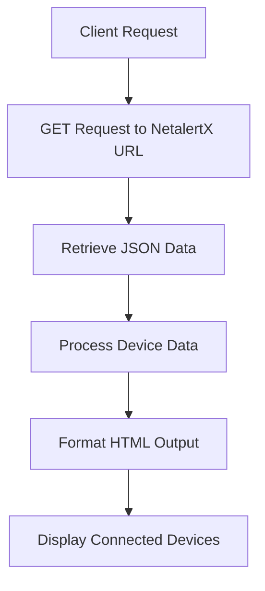
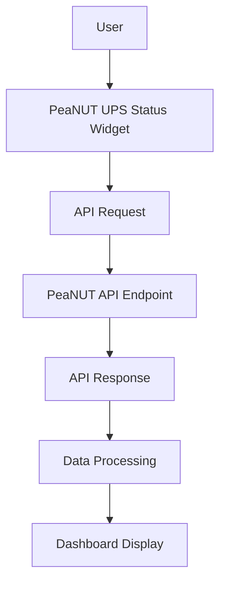
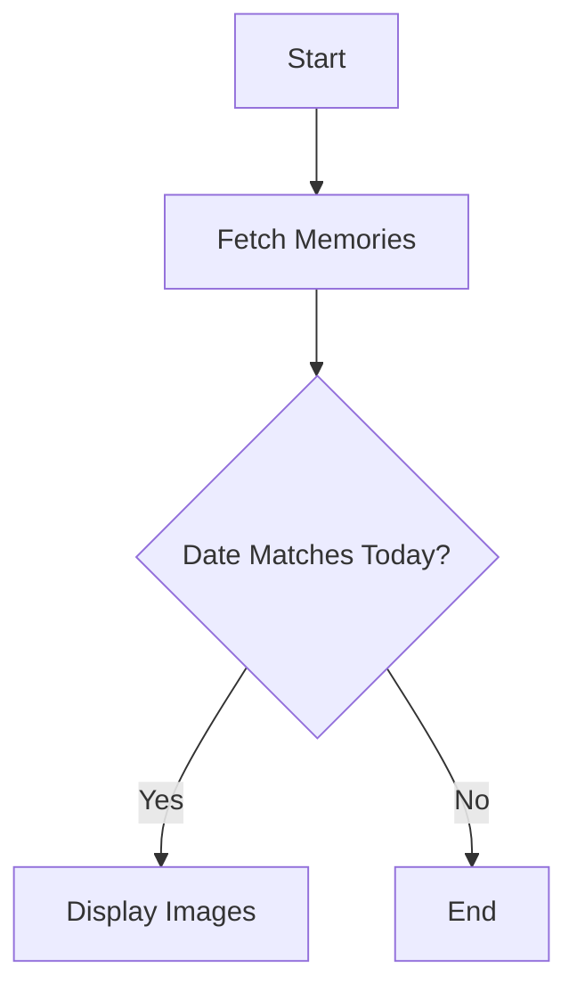

# Glance_custom_api BY RAZDNUT

Generated on: 2025-07-23 21:24:30

## Table of Contents

- [Overview](#page-1)
- [Karakeep Dashboard](#page-2)
- [NetalertX Custom API](#page-3)
- [PeaNUT UPS Status](#page-4)
- [Immich Memories API](#page-5)

<a id='page-1'></a>

## Overview


<details>
<summary>Relevant source files</summary>

- [README.md](https://github.com/Razdnut/glance_custom_api_test/blob/main/README.md)
- [netalertx_custom_api.yml](https://github.com/Razdnut/glance_custom_api_test/blob/main/netalertx_custom_api.yml)
- [karakeep-statistics.yml](https://github.com/Razdnut/glance_custom_api_test/blob/main/karakeep-statistics.yml)
- [peanut_status.yml](https://github.com/Razdnut/glance_custom_api_test/blob/main/peanut_status.yml)
- [immich_memories_broken.yml](https://github.com/Razdnut/glance_custom_api_test/blob/main/immich_memories_broken.yml)
</details>

# Overview

## Introduction

The "glance_custom_api_test" repository contains a set of custom API widgets designed for various monitoring and data retrieval tasks. These widgets are configured to fetch data from specified endpoints and display the results in a user-friendly format. The primary objective is to facilitate real-time data visualization for systems such as NetAlertX, Karakeep, PeaNUT UPS, and Immich Memories. Each widget is defined in a YAML configuration file that specifies the API endpoint, request method, caching strategy, and the template for rendering the output.

## NetAlertX Device Status

This widget is configured to retrieve the status of devices from a NetAlertX server. It uses a GET request to fetch device data and presents it in a styled HTML format.

### Configuration

- **Type:** Custom API
- **Title:** NetAlertX Device Status
- **Method:** GET
- **Cache:** 5 minutes
- **URL:** `http://${NETALERTX_URL}/php/server/query_json.php?file=table_devices.json`
- **Headers:** Accept: application/json

### Template

The template processes the JSON response to count and list connected devices. Devices are displayed with their name, status, and last known IP address.

```yaml
{{ $data := .JSON.Array "data" }}
{{ $connectedDevicesCount := 0 }}
{{ range $dev := $data }}
  {{ if eq ($dev.Int "devPresentLastScan") 1 }}
    {{ $connectedDevicesCount = add $connectedDevicesCount 1 }}
  {{ end }}
{{ end }}
```

Sources: [netalertx_custom_api.yml]()

## Karakeep Statistics

This widget provides an overview of user statistics from the Karakeep service, including the number of bookmarks and tags.

### Configuration

- **Type:** Custom API
- **Title:** Karakeep Stats
- **Method:** GET
- **Cache:** 10 minutes
- **URL:** `https://${KARAKEEP_URL}/api/v1/users/me/stats`
- **Headers:** Authorization: Bearer ${KARAKEEP_API_KEY}, Accept: application/json

### Template

The template extracts and displays the number of bookmarks and tags using a simple flexbox layout for alignment.

```yaml
<div class="flex justify-center gap-10 text-center">
  <div>
    <div class="color-highlight size-h3">{{ .JSON.Int "numBookmarks" | formatNumber }}</div>
    <div class="size-h6">BOOKMARKS</div>
  </div>
  <div>
    <div class="color-highlight size-h3">{{ .JSON.Int "numTags" | formatNumber }}</div>
    <div class="size-h6">TAGS</div>
  </div>
</div>
```

Sources: [karakeep-statistics.yml]()

## PeaNUT UPS Status

This widget monitors the status of a PeaNUT UPS device, providing details about battery charge, runtime, voltage, and load.

### Configuration

- **Type:** Custom API
- **Title:** PeaNUT UPS Status
- **Method:** GET
- **Cache:** 1 minute
- **URL:** `http://${PEANUT_URL}/api/v1/devices/${PEANUT_DEVICE}`
- **Headers:** Accept: application/json, Authorization: "Basic ${PEANUT_AUTH}"

### Template

The template displays battery status, runtime, voltage, model, load, and nominal power.

```yaml
{{ $batteryCharge := $j.Int "battery\\.charge" }}
{{ $batteryRuntime := $j.Int "battery\\.runtime" }}
{{ $batteryVoltage := $j.Float "battery\\.voltage" }}
{{ $deviceModel := $j.Int "device\\.model" }}
{{ $upsLoad := $j.Int "ups\\.load" }}
```

Sources: [peanut_status.yml]()

## Immich Memories "On This Day" CURRENTLY NOT WORKING

This widget displays memories from the Immich platform that occurred on the current date in previous years.

### Configuration

- **Type:** Custom API
- **Title:** Immich Memories “On This Day”
- **Method:** GET
- **Cache:** 1 minute
- **URL:** `http://${IMMICH_URL_LOCAL}/api/memories?type=on_this_day`
- **Headers:** x-api-key: ${IMMICH_API_KEY}, Accept: application/json

### Template

The template checks for memories that match today's date and displays them with an image preview.

```yaml
{{ $today := now | formatTime "2006-01-02" }}
{{ $todayMD := slice $today 5 10 }}
{{ range $memory := .JSON.Array "" }}
  {{ $showAt := $memory.String "showAt" }}
  {{ if eq $showAtMD $todayMD }}
```

Sources: [immich_memories_broken.yml]()

## Conclusion

The "glance_custom_api_test" repository offers a versatile set of API widgets for real-time data visualization across various systems. Each widget is carefully configured to fetch, process, and display data in a meaningful way, enhancing monitoring capabilities and user interaction.

---

<a id='page-2'></a>

## Karakeep Dashboard

### Related Pages

Related topics: [Overview](#page-1)

<details>
<summary>Relevant source files</summary>

- [karakeep_dashboard.yml](https://github.com/Razdnut/glance_custom_api_test/blob/main/karakeep_dashboard.yml)
- [karakeep-last-bookmarks.yml](https://github.com/Razdnut/glance_custom_api_test/blob/main/karakeep-last-bookmarks.yml)
- [karakeep-statistics.yml](https://github.com/Razdnut/glance_custom_api_test/blob/main/karakeep-statistics.yml)
- [README.md](https://github.com/Razdnut/glance_custom_api_test/blob/main/README.md)
- [netalertx_custom_api.yml](https://github.com/Razdnut/glance_custom_api_test/blob/main/netalertx_custom_api.yml)
</details>

# Karakeep Dashboard

## Introduction
The Karakeep Dashboard is a comprehensive feature designed to provide users with an enhanced overview and management experience of their bookmarks and tags within the Karakeep system. It aggregates statistical data and presents the most recent bookmarks, offering a user-friendly interface for efficient navigation and interaction. The dashboard is a part of a larger suite of custom API widgets that facilitate seamless integration with various data sources.

## Architecture and Components
The Karakeep Dashboard is structured around several key components and API endpoints that gather and display user data. This section breaks down the components and their interactions as defined in the source files.

### API Endpoints
The dashboard utilizes custom API endpoints to fetch user statistics and bookmarks. These endpoints are secured with API keys and support JSON data exchange.

- **User Statistics Endpoint**
  - **URL:** `https://${KARAKEEP_URL}/api/v1/users/me/stats`
  - **Method:** GET
  - **Headers:** Authorization and Accept
  - **Data:** Number of bookmarks and tags

- **Bookmarks Endpoint**
  - **URL:** `https://${KARAKEEP_URL}/api/v1/bookmarks?limit={limit}`
  - **Method:** GET
  - **Headers:** Authorization and Accept
  - **Data:** List of bookmarks

Sources: [karakeep_dashboard.yml](https://github.com/Razdnut/glance_custom_api_test/blob/main/karakeep_dashboard.yml), [karakeep-last-bookmarks.yml](https://github.com/Razdnut/glance_custom_api_test/blob/main/karakeep-last-bookmarks.yml)

### Data Flow and Logic
The data flow within the Karakeep Dashboard is managed through a series of requests and responses between the client and server. The logic is embedded within the template configurations of the YAML files.



Sources: [karakeep_dashboard.yml:10-40](https://github.com/Razdnut/glance_custom_api_test/blob/main/karakeep_dashboard.yml), [karakeep-last-bookmarks.yml:10-40](https://github.com/Razdnut/glance_custom_api_test/blob/main/karakeep-last-bookmarks.yml)

## Detailed Sections

### User Statistics
The dashboard displays user statistics prominently, showcasing the number of bookmarks and tags. This data is fetched from the user statistics endpoint and formatted for display.

```yaml
<div class="flex justify-center gap-10 text-center">
  <div>
    <div class="color-highlight size-h3">{{ .JSON.Int "numBookmarks" | formatNumber }}</div>
    <div class="size-h6">BOOKMARKS</div>
  </div>
  <div>
    <div class="color-highlight size-h3">{{ .JSON.Int "numTags" | formatNumber }}</div>
    <div class="size-h6">TAGS</div>
  </div>
</div>
```

Sources: [karakeep-statistics.yml:10-20](https://github.com/Razdnut/glance_custom_api_test/blob/main/karakeep-statistics.yml)

### Recent Bookmarks
The recent bookmarks section is designed to list the most recently added bookmarks, allowing users quick access to their latest entries.

```yaml
<ul class="list list-gap-10 collapsible-container" data-collapse-after="{{ $collapseAfter }}" style="max-width: 100%; overflow-x: hidden; font-size: 1em; line-height: 1.3em; padding-left: 0; margin: 0;">
  {{ range $b := $bookmarks }}
    <li style="list-style: none; white-space: nowrap; overflow: hidden; text-overflow: ellipsis;">
      <a href="{{ $url }}"
         title="{{ $title }}"
         {{ if $newTab }} target="_blank" rel="noopener"{{ end }}
         class="color-highlight" style="text-decoration: none; cursor: pointer;">
        {{ $title }}
      </a>
    </li>
  {{ end }}
</ul>
```

Sources: [karakeep-last-bookmarks.yml:20-40](https://github.com/Razdnut/glance_custom_api_test/blob/main/karakeep-last-bookmarks.yml)

## Configuration Options
The Karakeep Dashboard allows for configurable options to tailor the user experience.

| Option          | Description                                   | Values             |
|-----------------|-----------------------------------------------|--------------------|
| `limit`         | Number of latest bookmarks to list            | 10, 20, or 30      |
| `in-new-tab`    | Open links in a new browser tab               | `true` or `false`  |
| `collapse-after`| Collapse list after this many items           | Integer (e.g., 5, 10)|

Sources: [README.md:30-40](https://github.com/Razdnut/glance_custom_api_test/blob/main/README.md)

## Conclusion
The Karakeep Dashboard is a pivotal component of the custom API widgets, providing users with a detailed and interactive interface to manage their bookmarks and view statistics. Its integration with secure API endpoints and configurable options ensures a robust and flexible user experience, enhancing productivity and data accessibility within the Karakeep ecosystem.

---

<a id='page-3'></a>

## NetalertX Custom API

### Related Pages

Related topics: [Overview](#page-1)

<details>
<summary>Relevant source files</summary>

- [netalertx_custom_api.yml](https://github.com/Razdnut/glance_custom_api_test/blob/main/netalertx_custom_api.yml)
- [karakeep-statistics.yml](https://github.com/Razdnut/glance_custom_api_test/blob/main/karakeep-statistics.yml)
- [peanut_status.yml](https://github.com/Razdnut/glance_custom_api_test/blob/main/peanut_status.yml)
- [immich_memories_broken.yml](https://github.com/Razdnut/glance_custom_api_test/blob/main/immich_memories_broken.yml)
- [karakeep-last-bookmarks.yml](https://github.com/Razdnut/glance_custom_api_test/blob/main/karakeep-last-bookmarks.yml)
</details>

# NetalertX Custom API

## Introduction
The NetalertX Custom API provides a mechanism for retrieving and displaying the status of devices connected to the NetalertX system. This API is part of a larger suite of custom APIs designed to integrate with various systems, providing real-time data through a standardized interface. The primary function of the NetalertX Custom API is to query the device status data from a specified URL and present it in a user-friendly format.

## Architecture and Components
The NetalertX Custom API is structured to perform a GET request to a specified endpoint, retrieve JSON data, and format this data for display. The architecture is based on a simple API call mechanism with caching to optimize performance.

### API Endpoint
The endpoint for the NetalertX Custom API is defined in the configuration file `netalertx_custom_api.yml`. The API uses the following parameters:

- **Method:** GET
- **URL:** `http://${NETALERTX_URL}/php/server/query_json.php?file=table_devices.json`
- **Headers:** Accepts `application/json`
- **Cache Duration:** 5 minutes

### Data Processing
The API processes the JSON data to extract relevant information about connected devices. It calculates the total number of devices and the number of devices currently connected.

```yaml
- type: custom-api
  title: NetAlertX Device Status
  method: GET
  cache: 5m
  url: http://${NETALERTX_URL}/php/server/query_json.php?file=table_devices.json
  headers:
    Accept: application/json
  template: |
    {{ $data := .JSON.Array "data" }}
    {{ $totalDevices := len $data }}
    {{ $connectedDevicesCount := 0 }}
    {{ range $dev := $data }}
      {{ if eq ($dev.Int "devPresentLastScan") 1 }}
        {{ $connectedDevicesCount = add $connectedDevicesCount 1 }}
      {{ end }}
    {{ end }}
```
Sources: [netalertx_custom_api.yml](https://github.com/Razdnut/glance_custom_api_test/blob/main/netalertx_custom_api.yml)

### Display Logic
The API formats the data into a structured HTML output, highlighting connected devices with relevant details such as the device name, status, and last IP address.

```yaml
<div style="font-weight: bold; font-size: 1.2em; margin-bottom: 0.5em; display:flex; gap: 1rem;">
  <details style="flex: 1;" open>
    <summary style="cursor: pointer; font-weight: 600;">Connected ({{ $connectedDevicesCount }})</summary>
    <div style="max-height: 300px; overflow-y: auto; padding-right: 6px;">
      <ul style="padding-left: 0; margin: 0; list-style: none;">
        {{ range $dev := $data }}
          {{ if eq ($dev.Int "devPresentLastScan") 1 }}
            {{ $iconData := $dev.String "devIcon" }}
            {{ $name := $dev.String "devName" }}
            {{ $displayName := $name }}
            {{ if gt (len $name) 26 }}
              {{ $displayName = printf "%s…" (slice $name 0 26) }}
            {{ end }}
            <li style="margin-bottom: 1em;">
              <div style="display: flex; align-items: center; gap: 8px; flex-wrap: wrap;">
                {{ if ne $iconData "" }}
                  
                {{ end }}
                <span title="{{ $name }}" style="font-weight: 600; font-size: 0.9em; white-space: nowrap; overflow: hidden; text-overflow: ellipsis; max-width: 200px;">
                  {{ $displayName }}
                </span>
                <span style="padding: 2px 6px; font-size: 0.75em; color: var(--color-positive); border: 1px solid var(--color-positive); border-radius: 4px; white-space: normal; max-width: 100px; word-break: break-word;">
                  {{ $dev.String "devStatus" }}
                </span>
              </div>
              <div title="{{ $dev.String "devLastIP" }}" style="font-size: 0.75em; color: var(--color-subtle); margin-top: 2px; white-space: nowrap; overflow: hidden; text-overflow: ellipsis; max-width: 200px;">
                {{ $dev.String "devLastIP" }}
              </div>
            </li>
          {{ end }}
        {{ end }}
      </ul>
    </div>
  </details>
</div>
```
Sources: [netalertx_custom_api.yml](https://github.com/Razdnut/glance_custom_api_test/blob/main/netalertx_custom_api.yml)

## Data Flow Diagram
The following diagram illustrates the data flow within the NetalertX Custom API:


Sources: [netalertx_custom_api.yml](https://github.com/Razdnut/glance_custom_api_test/blob/main/netalertx_custom_api.yml)

## Key Features and Configuration

| Feature              | Description                                                      | Default Value |
|----------------------|------------------------------------------------------------------|---------------|
| `method`             | HTTP method used for the API call                                | GET           |
| `url`                | Endpoint URL for retrieving device data                          | N/A           |
| `cache`              | Duration for which the API response is cached                    | 5m            |
| `headers`            | HTTP headers for the API request                                 | Accept: application/json |
| `template`           | HTML template used for formatting the device data                | N/A           |

Sources: [netalertx_custom_api.yml](https://github.com/Razdnut/glance_custom_api_test/blob/main/netalertx_custom_api.yml)

## Conclusion
The NetalertX Custom API is a crucial component of the project, enabling real-time monitoring and display of device status within the NetalertX system. By leveraging a simple GET request and efficient data processing, it provides a clear and concise interface for users to view connected device information.

This API is part of a broader suite of custom APIs that facilitate integration with various systems, enhancing the overall functionality and usability of the project.

---

<a id='page-4'></a>

## PeaNUT UPS Status

### Related Pages

Related topics: [Overview](#page-1)

<details>
<summary>Relevant source files</summary>

- [peanut_status.yml](https://github.com/Razdnut/glance_custom_api_test/blob/main/peanut_status.yml)
- [netalertx_custom_api.yml](https://github.com/Razdnut/glance_custom_api_test/blob/main/netalertx_custom_api.yml)
- [README.md](https://github.com/Razdnut/glance_custom_api_test/blob/main/README.md)
- [karakeep-statistics.yml](https://github.com/Razdnut/glance_custom_api_test/blob/main/karakeep-statistics.yml)
- [karakeep_dashboard.yml](https://github.com/Razdnut/glance_custom_api_test/blob/main/karakeep_dashboard.yml)
</details>

# PeaNUT UPS Status

## Introduction

The PeaNUT UPS Status is a custom API widget designed to provide real-time information about the status of a PeaNUT UPS device. This widget is part of a larger project that includes various custom API integrations aimed at enhancing device monitoring and management capabilities. The PeaNUT UPS Status widget fetches data from a specified API endpoint and displays critical information such as battery charge, runtime, voltage, and load in a user-friendly format. This integration allows users to monitor UPS devices efficiently, ensuring that critical systems remain operational during power disruptions.

## Architecture and Components

### API Configuration

The PeaNUT UPS Status widget is configured as a custom API type within the system. It retrieves data using a GET request to a specified URL, utilizing parameters and headers for authentication and data formatting. 

```yaml
- type: custom-api
  title: PeaNUT UPS Status
  url: http://${PEANUT_URL}/api/v1/devices/${PEANUT_DEVICE}
  method: GET
  cache: 1m
  headers:
    Accept: application/json
    Authorization: "Basic ${PEANUT_AUTH}"
```

**Sources:** [peanut_status.yml:2-9]()

### Data Processing and Template

The widget processes JSON data received from the API, extracting key metrics related to the UPS device's status. It uses a Go template to format and display this information on a dashboard.

```yaml
template: |
  {{ $j := .JSON }}
  {{ $batteryCharge := $j.Int "battery\\.charge" }}
  {{ $batteryRuntime := $j.Int "battery\\.runtime" }}
  {{ $batteryVoltage := $j.Float "battery\\.voltage" }}
  {{ $deviceModel := $j.Int "device\\.model" }}
  {{ $upsLoad := $j.Int "ups\\.load" }}
  {{ $upsNominalPower := $j.Int "ups\\.realpower\\.nominal" }}
  {{ $currentLoad := div (mul $upsLoad $upsNominalPower) 100 }}
```

**Sources:** [peanut_status.yml:11-21]()

### Display Format

The data is rendered in an HTML format, using inline CSS for styling. This ensures the information is presented clearly and is easy to read.

```html
<div style="font-family:Arial,sans-serif;color:#f5f5f5;line-height:1.5;max-width:300px;">
  <p style="margin:4px 0;font-size:1.1em;">🔋 Battery: <strong>{{ printf "%d%%" $batteryCharge}}</strong></p>
  <p style="margin:4px 0;font-size:1.1em;">⏱️ Runtime: <strong>{{ printf "%d min" (div $batteryRuntime 60) }}</strong></p>
  <p style="margin:4px 0;font-size:1.1em;">⚡ Voltage: <strong>{{ printf "%.1f V" $batteryVoltage }}</strong></p>
  <p style="margin:4px 0;font-size:1.1em;">📟 Model: <strong>{{ printf "%d VA" $deviceModel }}</strong></p>
  <p style="margin:4px 0;font-size:1.1em;">🏋️ Load: <strong>{{ printf "%d%%" $upsLoad  }}</strong></p>
  <p style="margin:4px 0;font-size:1.1em;">⚙️ Nominal: <strong>{{ printf "%d W" $upsNominalPower }}</strong></p>
  <hr style="border:none;border-top:1px solid #ddd;margin:8px 0;max-width:150px">
  <p style="margin:4px 0;font-size:1.1em;">🔌 Current: <strong>{{ printf "%d W" $currentLoad }}</strong></p>
</div>
```

**Sources:** [peanut_status.yml:23-34]()

## Data Flow



The flowchart illustrates the data flow from the user interaction with the PeaNUT UPS Status widget to the display of processed data on the dashboard. The widget sends a request to the API endpoint, processes the response data, and formats it for display.

**Sources:** [peanut_status.yml:2-34]()

## Configuration Options

The PeaNUT UPS Status widget allows for customization through environment variables and options:

| Option       | Description                                  | Example Value            |
|--------------|----------------------------------------------|--------------------------|
| PEANUT_URL   | Base URL for the PeaNUT API                  | `peanut.domain.com`      |
| PEANUT_DEVICE| Device identifier for the UPS                | `device123`              |
| PEANUT_AUTH  | Authorization credentials for API access     | `Basic abcdef123456`     |

**Sources:** [peanut_status.yml:2-9]()

## Conclusion

The PeaNUT UPS Status widget provides a comprehensive and user-friendly interface for monitoring UPS devices. By integrating directly with the PeaNUT API, it ensures that users have access to critical information in real-time, enhancing the reliability and management of power systems within the project.

**Sources:** [peanut_status.yml:2-34]()

---

<a id='page-5'></a>

## Immich Memories API

### Related Pages

Related topics: [Overview](#page-1)

<details>
<summary>Relevant source files</summary>

- [immich_memories_broken.yml](https://github.com/Razdnut/glance_custom_api_test/blob/main/immich_memories_broken.yml)
- [karakeep-statistics.yml](https://github.com/Razdnut/glance_custom_api_test/blob/main/karakeep-statistics.yml)
- [karakeep-last-bookmarks.yml](https://github.com/Razdnut/glance_custom_api_test/blob/main/karakeep-last-bookmarks.yml)
- [karakeep_dashboard.yml](https://github.com/Razdnut/glance_custom_api_test/blob/main/karakeep_dashboard.yml)
- [peanut_status.yml](https://github.com/Razdnut/glance_custom_api_test/blob/main/peanut_status.yml)

</details>

# Immich Memories API CURRENTLY NOT WORKING (CORS LIMITS)

## Introduction

The Immich Memories API is a part of the glance_custom_api_test project, designed to retrieve and display user memories from a specified endpoint. This API focuses on fetching memories tagged with "on this day," allowing users to reminisce about past events on the same date. The API integrates with the broader system, utilizing custom API widgets to provide a seamless user experience. This document outlines the API's architecture, configuration, and implementation details, providing a comprehensive guide for developers interacting with this module. CURRENTLY UNDER DEVELOPMENT DUE TO CORS BLOCKS PREVENTING IMAGES FROM LOADING.

## Architecture and Components

### API Configuration

The Immich Memories API is configured to use a custom endpoint that fetches memories based on the current date. The configuration file `immich_memories_broken.yml` specifies the base URL, API key, and request headers necessary for making API calls.

```yaml
- type: custom-api
  title: Immich Memories “On This Day”
  cache: 1m
  options:
    base-url: ${IMMICH_URL_LOCAL}
  url: http://${IMMICH_URL_LOCAL}/api/memories?type=on_this_day
  method: GET
  headers:
    x-api-key: ${IMMICH_API_KEY}
    Accept: application/json
```

The API requires a base URL and an API key for authentication. The endpoint is configured to fetch memories of type "on_this_day." The cache is set to 1 minute to ensure that data is frequently updated. Sources: [immich_memories_broken.yml:1-12]()

### Data Flow and Logic

The API processes the response to display images associated with memories. It checks if the memory's date matches the current date, and if so, it renders the images.

```yaml
{{ $base := .Options.StringOr "base-url" "" }}
{{ $today := now | formatTime "2006-01-02" }}
{{ $todayMD := slice $today 5 10 }}
{{ range $memory := .JSON.Array "" }}
  {{ $showAt := $memory.String "showAt" }}
  {{ $showAtMD := slice $showAt 5 10 }}
  {{ if eq $showAtMD $todayMD }}
    {{ range $asset := $memory.Array "assets" }}
      {{ $id := $asset.String "id" }}
      {{ $thumb := $asset.String "thumbhash" }}
      {{ $fileName := $asset.String "originalFileName" }}
      {{ if and (ne $id "") (or (eq $ext4 ".jpg") (eq $ext4 ".png") (eq $ext5 ".jpeg")) }}
        {{ $imgUrl := printf "http://%s/api/assets/%s/thumbnail?size=thumbnail&c=%s" $base $id $thumb }}
        <div class="img-container">
          <a href="http://{{ $base }}/memory?id={{ $id }}" target="_blank" rel="noopener noreferrer">
            
          </a>
        </div>
      {{ end }}
    {{ end }}
  {{ end }}
{{ end }}
```

This code snippet processes each memory to check if it falls on the current date, and if so, displays associated images. Sources: [immich_memories_broken.yml:13-49]()

### Mermaid Diagram



This flowchart represents the logic of checking each memory's date and displaying images if it matches today's date. Sources: [immich_memories_broken.yml]()

## API Endpoints and Parameters

### Endpoint Details

The Immich Memories API utilizes a single GET endpoint to fetch memories:

| Parameter    | Type   | Description                       |
|--------------|--------|-----------------------------------|
| base-url     | String | Base URL for the API endpoint     |
| x-api-key    | String | API key for authentication        |
| type         | String | Type of memory to fetch ("on_this_day") |

This table summarizes the key parameters required for making requests to the Immich Memories API. Sources: [immich_memories_broken.yml:3-12]()

## Conclusion

The Immich Memories API provides a focused functionality within the glance_custom_api_test project to retrieve and display user memories from the same date in past years. Its configuration and implementation are tailored to provide an efficient and user-friendly experience, leveraging custom API widgets and a simple yet effective data processing logic. This document serves as a technical guide for developers looking to understand or extend the Immich Memories API's capabilities.

---

